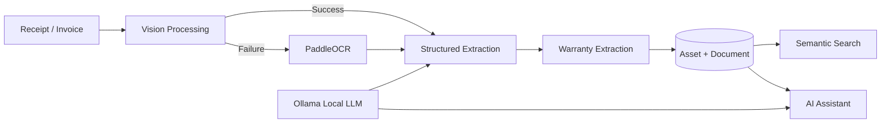

<div align="center">

# ⚡ WarrantyVault

### AI-Powered Receipt Intelligence & Warranty Management

**Turn messy receipts into searchable digital assets.**

<p>


</p>

**Upload → Understand → Extract → Store → Search → Ask**

</div>

---

## The Problem

You bought a laptop eight months ago.

Now it stops working.

You know you have a warranty — but finding the information means searching through **emails, PDFs, gallery images and old invoices**.

The information exists.

**It's just trapped inside an unstructured document.**

WarrantyVault turns that document into a structured, searchable asset containing the product, seller, invoice details, purchase date, price and warranty information.

---

## How It Works



### One document. Multiple intelligence layers.

```text
Receipt
   │
   ▼
Vision Processing
   │
   ├── success ──────────────┐
   │                         │
   └── failure → PaddleOCR ──┤
                             ▼
                      Receipt Extraction
                             │
                             ▼
                      Warranty Extraction
                             │
                             ▼
                      Structured Asset
                        ┌────┴────┐
                        ▼         ▼
                     Search    Assistant
```

---

## Why It's More Than OCR

A traditional OCR pipeline gives you:

```text
Receipt → Text
```

WarrantyVault turns it into:

```text
Receipt
   ↓
Visual / OCR Understanding
   ↓
AI Extraction
   ↓
Structured Purchase Data
   ↓
Warranty Logic
   ↓
Searchable Asset
   ↓
AI Assistant
```

The interesting part isn't simply **reading the receipt**.

It's turning unstructured purchase documents into data that the application can **store, search and reason about**.

---

## Local AI with Ollama

WarrantyVault uses **Ollama** as the local LLM runtime.

```text
Receipt
   ↓
Vision / OCR
   ↓
Extracted Information
   ↓
Ollama
   ↓
Structured Data
   ↓
Asset + Warranty Intelligence
```

This keeps the AI layer integrated into the application's document-processing pipeline rather than treating the project as just a chatbot wrapped around an API.

---

## What Gets Extracted?

| Purchase Intelligence | Warranty Intelligence |
|---|---|
| Product | Warranty duration |
| Product ID | Warranty source |
| Seller | Warranty expiry |
| Invoice number | Warranty status |
| Order number | Purchase date |
| Invoice date | Total amount |

The original document is also preserved separately through the **Document → Asset** relationship.

---

## Architecture

```text
┌──────────────────┐
│    React UI      │
└────────┬─────────┘
         │
         ▼
┌──────────────────┐
│    FastAPI       │
│      API         │
└────────┬─────────┘
         │
         ▼
┌──────────────────────────────┐
│        Service Layer         │
│                              │
│ Receipt • Vision • OCR       │
│ Warranty • Assets • Search   │
│ Assistant • Claims           │
└──────────────┬───────────────┘
               │
       ┌───────┼────────┐
       ▼       ▼        ▼
    Ollama  PaddleOCR  Database
```

---

## Tech Stack

**Backend**
- Python
- FastAPI
- SQLAlchemy

**AI / Document Intelligence**
- Ollama
- Vision processing
- PaddleOCR
- Semantic search

**Frontend**
- React
- Vite

---

## API

| Method | Endpoint | Purpose |
|---|---|---|
| `POST` | `/api/receipts/upload` | Upload receipt |
| `POST` | `/api/assets/process` | Process asset |
| `GET` | `/api/assets/` | Get assets |
| `GET` | `/api/assets/search` | Search assets |
| `GET` | `/api/assets/{id}/documents` | Get documents |
| `DELETE` | `/api/assets/{id}` | Delete asset |

Interactive API documentation is available at:

```text
http://127.0.0.1:8000/docs
```

---

## Run Locally

### Backend

```bash
cd backend
python -m venv venv
venv\Scripts\activate
pip install -r requirements.txt
python create_tables.py
uvicorn app.main:app --reload
```

### Frontend

```bash
cd frontend
npm install
npm run dev
```

Make sure **Ollama is running locally** and configured for the project's AI services.

---

## Testing

The project includes tests covering:

```text
Receipt Extraction
OCR
Vision Processing
Warranty Extraction
Warranty Service
Asset Service
Semantic Search
API End-to-End Flow
```

---

<div align="center">

### From a receipt nobody wants to search...

**to an asset an AI can understand.**

`UPLOAD → UNDERSTAND → EXTRACT → STORE → SEARCH → ASK`

</div>
